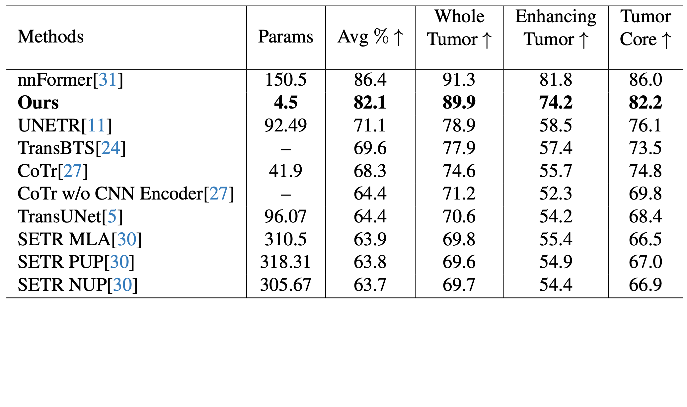

# SegFormer3D
## An Efficient Transformer for 3D Medical Image Segmentation
<p align="center">
  <div style="position: relative; display: inline-block;">
    
    
  </div>
</p>

Segformer3D is a light-weight and efficient hierarchical Transformer designed for 3D volumetric segmentation. It calculates attention across multiscale volumetric features, and avoids complex decoders. Instead it uses a simple yet effective all-MLP decoder to aggregate local and global attention features to produce highly accurate segmentation masks. Published at DEF-AI-MIA workshop in CVPR 2024.

The implementation of SegFormer3D architecture is in `architectures/segformer3d.py`. The experimentatl setup and implementaiton details are throuhgly explained in our [paper](https://arxiv.org/abs/2404.10156).

Step by step guideline for BraTs is provided below. Other datasets are coming soon.

Contributions are highly encouraged 🙂

## :rocket: News
* **(April 15, 2024):** SegFormer3D code & weights are released for BRaTs.


## Table of Contents
Follow steps 1-3 to run our pipeline. 
1. [Installation](#Installation) 
2. [Prepare the Dataset](#Prepare-the-Dataset)
    - [preprocessing](#preprocessing)
    - [data split (optional)](#data-split-Optional)
3. [Run Your Experiment](#Run-Your-Experiment)
4. [Visualization](#Visualization)
5. [Results](#Results)
    - [BraTs](#Brain-Tumor-Segmentation-Dataset-BraTs)
    - [Synapse](#Multi-Organ-CT-Segmentation-Dataset-Synapse)
    - [ACDC](#Automated-Cardiac-Diagnosis-Dataset-ACDC)

## Installation
Make sure you have [conda](https://conda.io/projects/conda/en/latest/user-guide/install/index.html#regular-installation) installed and run the following lines of commands in your terminal:
```shell
git clone https://github.com/OSUPCVLab/SegFormer3D.git
cd SegFormer3D
conda create -n "segformer3d" python=3.11.7 ipython==8.12.0
conda activate segformer3d
conda install pytorch==2.1.0 torchvision==0.16.0 torchaudio==2.1.0 pytorch-cuda=11.8 -c pytorch -c nvidia
# make sure <which python> and <which pip> points to the created environment directory
python -m pip install -r requirements.txt
```
For convenience, we call SegFormer3D repo's home directory `SEGFORMER3D_HOME`.
## Prepare the Dataset
🚨 Note: The processing code for both ACDC and Synapse datasets was implemented using the [nnFormer](https://github.com/282857341/nnFormer) repository. We chose to use this codebase to ensure a fair comparison with baseline architectures like nnFormer, which apply specific techniques during test-time data processing. Given the complexity of the nnFormer pipeline, offering a simplified, standalone guide for testing would have essentially required building a separate repository on top of SegFormer3D—something we opted not to do.

### preprocessing
First we need to make two folders (I call them `train`, `BraTS2017_Training_Data`) using the terminal:
```shell
cd SEGFORMER3D_HOME
mkdir "./data/brats2017_seg/brats2017_raw_data/train"
mkdir "./data/brats2017_seg/BraTS2017_Training_Data"
```
Download [Brats2017](https://drive.google.com/file/d/1LMrJRpcMjhsAT6tbstgB1GTdZBk5yKU8/view?usp=sharing). Open the zip file and extract the content into the `train` directory of the repo. Once the files are moved properly, you should see the following folder structure:

```
SEGFORMER3D_HOME/data/brats2017_seg/brats2017_raw_data/ 
 │
 ├───train
 │      ├──imageTr
 │      │      └──BRATS_001_0000.nii.gz
 │      │      └──BRATS_001_0001.nii.gz
 │      │      └──BRATS_001_0002.nii.gz
 │      │      └──BRATS_001_0003.nii.gz
 │      │      └──BRATS_002_0000.nii.gz
 │      │      └──...
 │      ├──labelsTr
 │      │      └──BRATS_001.nii.gz
 │      │      └──BRATS_002.nii.gz
 │      │      └──...
 │      ├──imageTs
 │      │      └──BRATS_485_000.nii.gz
 │      │      └──BRATS_485_001.nii.gz
 │      │      └──BRATS_485_002.nii.gz
 │      │      └──BRATS_485_003.nii.gz
 │      │      └──BRATS_486_000.nii.gz
 │      │      └──...
```
The `train` folder contains 484 MRI scans of the raw BraTs2017 data.

For the sake of accelerating the training process, we perform all the base preprocessing (zero cropping, collating the modalities, etc) prior to actually training the model. Run 
`brats2017_seg_preprocess.py` code which saves the preprocessed volumes into the `BraTS2017_Training_Data` folder. Having the data preprocess will save a lot of time during the training.

Simply run (this will take a while):
```shell
cd SEGFORMER3D_HOME
# assuming conda environment is still activated 
python ./data/brats2017_seg/brats2017_raw_data/brats2017_seg_preprocess.py
# you need around 22 GB to store the preprocessed data 
```
After this step, the dataset is saved in `BraTS2017_Training_Data` and is ready to be used for training.

Note: BraTs2021 dataloader and preprocessor are also available in our repo. You can use them the same way as explained for BraTs2017.
### data split (optional)
Inside `SEGFORMER3D_HOME/data/brats2017_seg` you see two csv files called `train.csv` and `validation.csv` which define the splits for training and validation data for your experiment. For generating different splits you can go to `SEGFORMER3D_HOME/data/brats2017_seg/brats2017_raw_data/datameta_generator`. 

You can also find kfold splits inside `SEGFORMER3D_HOME/data/brats2017_seg/brats2017_raw_data/datameta_generator`. For kfold experiment you have to change the `fold_id` inside the `train_dataset_args` and `val_dataset_args` section of your experiment's `config.yaml`. Use same fold id for both `train_dataset_args` and `val_dataset_args`. The default value is `fold_id: null` which flags the dataloader to read `train.csv` and `validation.csv`. You can change it to your desired fold id. For example, setting `fold_id: 1` in `train_dataset_args` and `val_dataset_args` will make the dataloader to read `validation_fold_1.csv` and `train_fold_1.csv` during the training. Just make sure your desired splits are present in `SEGFORMER3D_HOME/data/brats2017_seg`.

## Run Your Experiment
In order to run an experiment, we provide a template folder placed under `SEGFORMER3D_HOME/experiments/brats_2017/template_experiment` that you can use to setup your experiment. Simply copy the the template folder (maybe rename it to something more meaningful) and run your experiment on a single GPU with:
```shell
cd SEGFORMER3D_HOME
cd ./experiments/brats_2017/your_experiment_folder_name/
# the default gpu device is set to cuda:0 (you can change it)
accelerate launch --config_file ./gpu_accelerate.yaml run_experiment.py 
# you can modify the cuda device id by changing the value of gpu_ids attribute in the gpu_accelerate.yaml
# for example gpu_ids: '1' will run the experiment on cuda:1
```
You might want to change the hyperparameters (batch size, learning rate, weight decay etc.) of your experiment. For that you need to edit the `config.yaml` file inside your experiment folder. 

As the experiment is running, the logs (train loss, vlaidation loss and dice score) will be written to the terminal. You can log your experiment on [wandb](https://wandb.ai/site) 
(you need to setup an account there) if you set `mode: "online"` in the `wandb_parameters` section of the `config.yaml`. The default value is `mode: "offline"`. If you want to log the result to your wandb account, put your wandb info into the `wandb_parameters` section of the `config.yaml` and your entire experiment will be logged under your wandb entity (e.g. `pcvlab`) page.

During the experiment, the model checkpoints (optimizer, model_parameter etc.) will be saved in `SEGFORMER3D_HOME/experiments/brats_2017/your_experiment_folder_name/model_checkpoints/best_dice_checkpoint/` upon each improvement of the metric (Dice Score). Model parameters is saved as `pytorch_model.bin`.

You can download Segformer3d model weight trained on BraTs2017 from [[GoogleDrive]](https://drive.google.com/file/d/1MfcyyS6yEEC2-wQ5SHgC3v9sUVo285-I/view?usp=sharing).
## Visualization 
You can download SegFormer3D visualization results from this [link](https://drive.google.com/file/d/1QXAcZbOAdMDOkQXAAXHGLl6Y52j8-Aok/view?usp=sharing). This is a standalone folder that you might want to tinker with. `viz_meta.yaml` contains the hex color code for each dataset and other meta information for `viz.py` to visualize the data. By chaning the random seed number in `viz.py` you will get different frames visualized from the 3d volume input. We did not set any specific policy behind how we choose the frames to visualize because the volumetric inputs are considerably different with each other. Alternatively, you can modify `viz.py` according to your preference.

We got the visualization for nnFormer and UNETR form [nnFormer visualization results](https://drive.google.com/file/d/1Lb4rIkwIpuJS3tomBiKl7FBtNF2dv_6M/view).
## Results 
We benchmark SegFormer3D both qualitatively and quantitatively against the current state-of-the-art models such as [nnFormer](https://github.com/282857341/nnFormer), [UNETR](https://github.com/Project-MONAI/tutorials/blob/main/3d_segmentation/unetr_btcv_segmentation_3d.ipynb) and several other models on three widely used medical datasets: Synapse, BRaTs2017, and ACDC. The quatitative results are based on reported average Dice Score. 
### Brain Tumor Segmentation Dataset (BraTs)
[BraTs](https://www.med.upenn.edu/sbia/brats2017/data.html) is a collection of Magnetic Resonance Imaging (MRI) scans that contains 484 MRI images with four modalities, FLAIR, T1w, T1gd, and T2w. Data were collected from 19 institutions with ground-truth labels for three types of tumor subregions: edema (ED), enhancing tumor (ET) and nonenhancing tumor (NET). 
<p align="center">
  <div style="position: relative; display: inline-block;">
    
    
  </div>
</p>

### Multi-Organ CT Segmentation Dataset (Synapse)
The [Synapse](https://www.synapse.org/#!Synapse:syn3193805/wiki/217789) dataset provides 30 annotated CT images with thirteen abdominal organs.
<p align="center">
  <div style="position: relative; display: inline-block;">
    
    
  </div>
</p>

### Automated Cardiac Diagnosis Dataset (ACDC)
[ACDC](https://www.creatis.insa-lyon.fr/Challenge/acdc/databases.html) is a dataset of 100 patients used for 3D volumetric segmentation of the left (LV) and right (RV) cardiac ventricles and the myocardium (Myo).
<p align="center">
  <div style="position: relative; display: inline-block;">
    
    
  </div>
</p>

## Citation
If you liked our paper, please consider citing it
```bibtex
@inproceedings{perera2024segformer3d,
  title={SegFormer3D: an Efficient Transformer for 3D Medical Image Segmentation},
  author={Perera, Shehan and Navard, Pouyan and Yilmaz, Alper},
  booktitle={Proceedings of the IEEE/CVF Conference on Computer Vision and Pattern Recognition},
  pages={4981--4988},
  year={2024}
}
```
```bibtex
@article{perera2024segformer3d,
  title={SegFormer3D: an Efficient Transformer for 3D Medical Image Segmentation},
  author={Perera, Shehan and Navard, Pouyan and Yilmaz, Alper},
  journal={arXiv preprint arXiv:2404.10156},
  year={2024}
}
```
